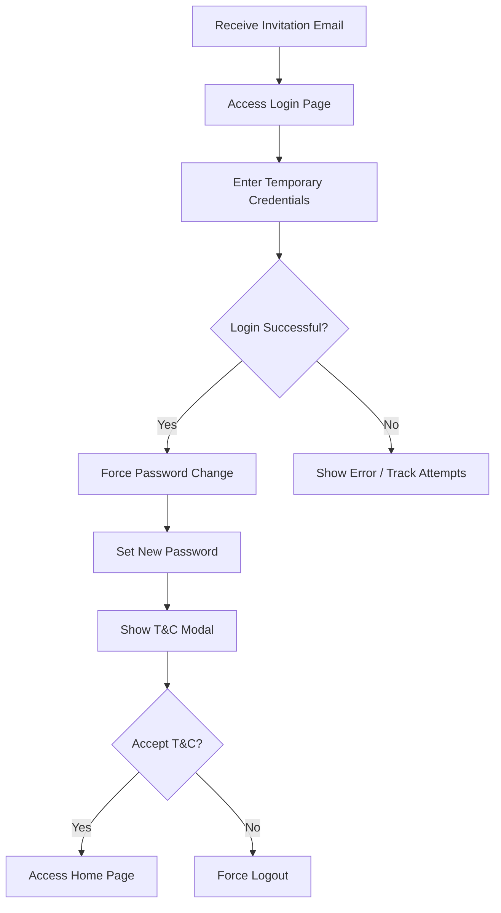
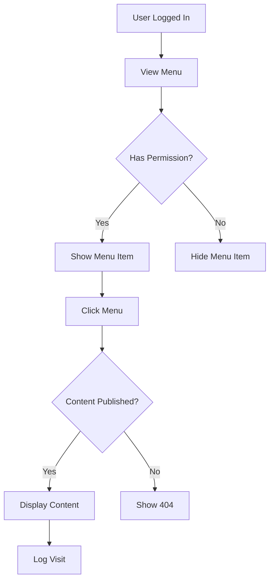

# **Analytics Hub - Web Application Requirements Document**

## **1. Executive Summary**

Analytics Hub is a secure web-based analytics platform that displays customized analytical content through static HTML/text and embedded reports from platforms like Microsoft Power BI, Tableau, and Google Data Studio. The system operates on an invitation-only basis with no public registration, ensuring controlled access through administrator-managed user invitations.

### **1.1 Key Features**
- Role-based access control (RBAC) with granular permissions
- Multi-level menu navigation (up to 3 levels)
- Dual content types: Custom HTML and Secure Embedded Reports
- Automated email notification system
- Real-time user activity monitoring
- IP-based security protection
- Terms & Conditions enforcement
- Comprehensive audit logging

### **1.2 Technology Stack**
- **Backend**: Laravel (PHP)
- **Database**: PostgreSQL
- **Frontend**: Dark theme UI with responsive design
- **Email**: SMTP with HTML templates
- **Security**: IP blacklisting, token-based authentication

---

## **2. System Architecture**

### **2.1 Access Control Hierarchy**

```
System Administrator (Full Access)
    ├── Administrator (System Management)
    └── Standard Users (Content Access Only)
        ├── Stakeholder
        ├── Management
        ├── Manager
        ├── Leader
        └── Officer
```

### **2.2 Module Structure**

1. **Core Modules**
   - Authentication & Authorization
   - User Management
   - Role & Permission Management
   - Menu Management
   - Content Management

2. **Supporting Modules**
   - Email Template System
   - Notification Center
   - Security Management
   - System Configuration
   - Activity Monitoring

---

## **3. Detailed Functional Requirements**

### **3.1 Authentication System**

#### **3.1.1 Login Process**
- **First-time Login**:
  - Users receive invitation email with temporary password (8 characters: uppercase, lowercase, numbers)
  - Forced password change on first login
  - Mandatory T&C acceptance
  - Session initialization

- **Regular Login**:
  - Email/password authentication
  - Failed login tracking (30 attempts = IP blacklist)
  - Session management with timeout
  - Remember me functionality (optional)

#### **3.1.2 Password Management**
- **Password Requirements**:
  - Minimum 8 characters
  - Must contain: uppercase, lowercase, numbers, special characters
  - Cannot reuse last 5 passwords
  - Password expiry: 90 days (configurable)

- **Forgot Password Flow**:
  - Email-based reset with UUID token
  - Token validity: 120 minutes, single-use
  - 30-second cooldown between requests
  - Secure token storage in `idbi_password_resets`

### **3.2 User Management**

#### **3.2.1 User Creation Process**
```
Admin Action → Create User Form → Generate Temp Password → 
Send Invitation Email → User First Login → Password Change → 
T&C Acceptance → Access Granted
```

#### **3.2.2 User Profile Features**
- **Editable Fields**:
  - Profile photo (max 2MB, 400x400px)
  - Password
  - Email notifications preference

- **Photo Upload Specifications**:
  - Accepted formats: JPG, PNG
  - Auto-crop functionality for oversized images
  - Default avatars available
  - Storage in `idbi_user_avatars`

#### **3.2.3 User Status Management**
- **Active**: Full access based on role
- **Suspended**: Login blocked, requires admin intervention
- **Pending**: Awaiting first login
- **Deleted**: Soft delete with data retention

### **3.3 Role & Permission Management**

#### **3.3.1 Permission Types**
- **Create**: Add new records
- **Read/View**: Access existing data
- **Update/Edit**: Modify existing records
- **Delete**: Remove records (soft/hard delete)
- **Export**: Download data
- **Import**: Upload bulk data

#### **3.3.2 Role Configuration**
- Dynamic role creation
- Permission assignment per module
- Menu access control
- Content visibility rules
- Hierarchical inheritance option

### **3.4 Menu Management**

#### **3.4.1 Menu Structure**
```
Root Menu (Level 1)
    ├── Child Menu (Level 2)
    │   └── Sub-child Menu (Level 3) → Content
    └── Child Menu (Level 2) → Content
```

#### **3.4.2 Menu Properties**
- **Display Name**: Localized menu title
- **Icon**: Material Design Icons from Iconify
- **Order Index**: Numerical sorting
- **URL/Route**: System route or content link
- **Visibility**: Role-based display rules
- **Active State**: Highlight current location

### **3.5 Content Management**

#### **3.5.1 Content Types**

**Custom Content**:
- Rich text editor (TinyMCE/CKEditor)
- HTML code support
- Media embedding (images, videos, documents)
- Table support with responsive design
- Code syntax highlighting

**Embedded Content**:
- Secure URL encryption/decryption
- UUID-based URL masking
- Supported platforms:
  - Microsoft Power BI
  - Tableau
  - Google Data Studio
  - Custom iframe sources

#### **3.5.2 Content Security**
- URL encryption algorithm: AES-256
- Database storage:
  - Original URL (encrypted)
  - Masked URL (UUID-based)
  - Access logs
- Browser inspection protection
- Copy prevention mechanisms

### **3.6 Email Template System**

#### **3.6.1 Template Types**
1. **Invitation Template** (System default)
   - User credentials
   - Welcome message
   - Login instructions

2. **Password Reset Template** (System default)
   - Reset link
   - Security notice
   - Expiry information

3. **Suspension Notice** (System default)
   - Suspension reason
   - Contact information

4. **Announcement Template** (Multiple allowed)
   - Custom HTML content
   - Bulk sending capability

#### **3.6.2 Dynamic Variables**
- `{{user_name}}` - Recipient's full name
- `{{user_email}}` - Recipient's email
- `{{temp_password}}` - Temporary password
- `{{reset_link}}` - Password reset URL
- `{{login_url}}` - Application login page
- `{{current_date}}` - Current date/time
- `{{company_name}}` - Organization name

### **3.7 Notification System**

#### **3.7.1 Notification Types**
- **System Notifications**:
  - Login success/failure
  - Password changes
  - Profile updates
  - Security alerts

- **Admin Announcements**:
  - System maintenance
  - New content alerts
  - Policy updates
  - General announcements

#### **3.7.2 Notification Features**
- Real-time push notifications
- Bell icon with unread count
- Mark as read/unread
- Notification history
- Filter by type/date
- Rich text support

### **3.8 Home Page Widgets**

#### **3.8.1 Widget Components**
1. **Marquee Text**: Smooth scrolling announcements
2. **Image Banner**: Auto-slideshow with captions
3. **Digital Clock**: Local time with full date
4. **Login Activity Chart**: 15-day trend line chart
5. **Top 5 Active Users**: Monthly login leaders
6. **Online Users**: Real-time active sessions
7. **Latest Announcements**: Recent 10 notifications
8. **New Users**: Latest 5 invited users
9. **Popular Content**: Top 5 visited pages

#### **3.8.2 Widget Layout**
- Responsive grid system
- Auto-refresh intervals:
  - Clock: 1 second
  - Online users: 30 seconds
  - Other widgets: 5 minutes
- Loading animations
- Error state handling

---

## **4. Technical Specifications**

### **4.1 Frontend Requirements**

#### **4.1.1 Theme & Styling**
- **Primary Background**: `#0E0E44` (Dark blue)
- **Primary Color**: `#FF7A00` (Orange)
- **Text Colors**:
  - Primary text: `#FFFFFF`
  - Secondary text: `#B0B0B0`
  - Success: `#4CAF50`
  - Warning: `#FFC107`
  - Error: `#F44336`

#### **4.1.2 UI Components**
- **Navigation**: Horizontal sticky navbar
- **Layout**: Wide content area, no sidebars
- **Animations**: 
  - Page transitions: 300ms ease
  - Loading screens: Canvas animation
  - Hover effects: Smooth color transitions
- **Responsive**: Desktop and tablet landscape only

#### **4.1.3 User Feedback**
- Toast notifications (Toastr/SweetAlert2)
- Loading masks during operations
- Form validation messages
- Confirmation dialogs
- Progress indicators

### **4.2 Security Implementation**

#### **4.2.1 IP Security**
- Automatic blacklisting after 30 failed attempts
- Manual IP blocking capability
- Whitelist option for trusted IPs
- Geographic restriction options
- Rate limiting per IP

#### **4.2.2 Session Security**
- Secure session cookies
- CSRF protection
- XSS prevention
- SQL injection protection
- Session timeout: 30 minutes idle

### **4.3 Database Schema**

#### **4.3.1 Naming Conventions**
- Table prefix: `idbi_`
- Primary keys: `id` (UUID)
- Foreign keys: `{table}_id`
- Timestamps: `created_at`, `updated_at`
- Soft deletes: `deleted_at`

#### **4.3.2 Performance Optimization**
- Indexed columns for frequent queries
- Database views for complex reports:
  - `v_top_active_users`
  - `v_login_trends`
  - `v_popular_content`
  - `v_online_users`
- Stored procedures for batch operations
- Query result caching

### **4.4 System Configuration**

#### **4.4.1 Configurable Elements**
- Application logo (navbar & login)
- Login page background
- Marquee text content
- Banner images and captions
- Footer content
- Failed login threshold
- Session timeout
- Password policies

#### **4.4.2 Monitoring Features**
- Function health checks
- Database connection status
- Email service availability
- External API connectivity
- Error logging
- Performance metrics

---

## **5. User Workflows**

### **5.1 First-Time User Journey**



### **5.2 Content Access Flow**



---

## **6. Integration Requirements**

### **6.1 Email Service**
- SMTP configuration
- Queue management for bulk emails
- Delivery tracking
- Bounce handling
- Template rendering engine

### **6.2 External Analytics Platforms**
- OAuth integration where applicable
- Secure token storage
- Refresh token management
- Error handling for expired embeds
- Fallback content options

### **6.3 Monitoring & Logging**
- Application logs: Laravel logs
- Access logs: Database tracking
- Error logs: Centralized error handling
- Security logs: Failed attempts, IP blocks
- Audit logs: User actions tracking

---

## **7. Performance Requirements**

### **7.1 Response Times**
- Page load: < 2 seconds
- API calls: < 500ms
- Database queries: < 100ms
- Email delivery: < 30 seconds

### **7.2 Concurrent Users**
- Support minimum 500 concurrent users
- Graceful degradation under load
- Queue management for heavy operations
- Caching strategy implementation

### **7.3 Data Retention**
- Activity logs: 1 year
- Deleted users: 90 days (soft delete)
- Password reset tokens: Auto-purge after expiry
- Session data: 24 hours after logout

---

## **8. Deployment & Maintenance**

### **8.1 Environment Setup**
- Development, Staging, Production environments
- Environment-specific configurations
- Database migration strategy
- Seeder data for initial setup

### **8.2 Backup Strategy**
- Daily database backups
- User-uploaded file backups
- Configuration backups
- Automated backup verification

### **8.3 Update Process**
- Zero-downtime deployments
- Database migration automation
- Cache clearing procedures
- User notification for maintenance

---

## **9. Future Enhancements**

### **9.1 Planned Features**
- Multi-language support
- Mobile responsive design
- API for external integrations
- Advanced analytics dashboard
- Two-factor authentication
- SSO integration

### **9.2 Scalability Considerations**
- Microservices architecture preparation
- CDN implementation for static assets
- Database sharding strategy
- Horizontal scaling capabilities

---

## **10. Appendices**

### **10.1 Database Table Reference**
[Detailed table structures with columns, types, and relationships]

### **10.2 API Documentation**
[RESTful API endpoints and specifications]

### **10.3 Error Code Reference**
[Comprehensive error codes and messages]

### **10.4 Glossary**
[Technical terms and abbreviations]
